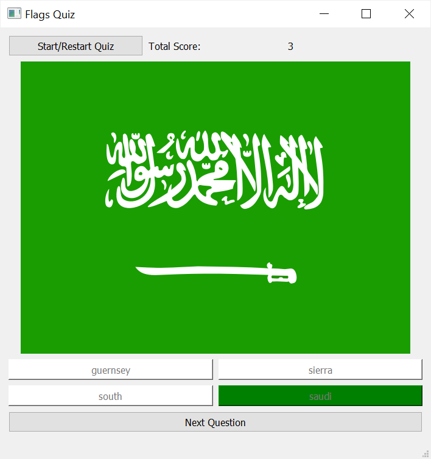
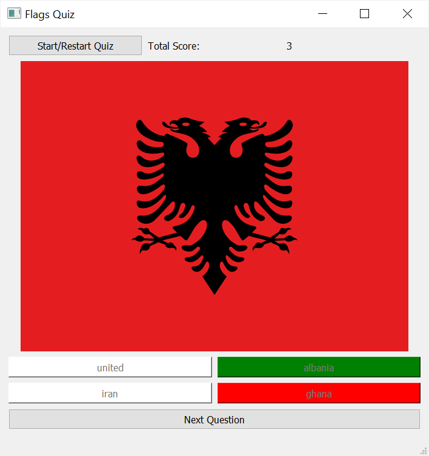
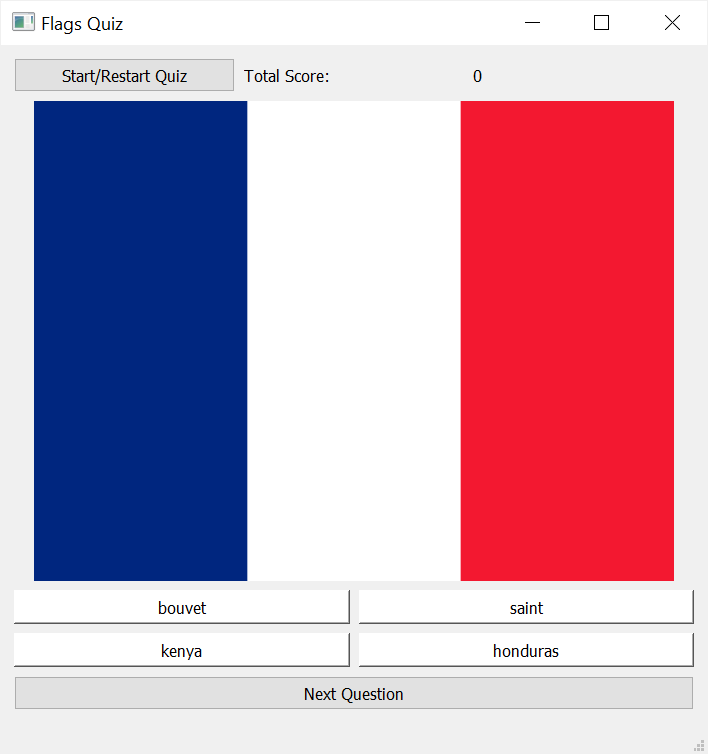

# Flags Quiz
flags quiz script with python and pyqt5




## This is a Flags Quiz Game.

#### The modules Used to make this script are:-

        -PyQt5
        -random

This is a GUI based python script.

## Install
```
- Download this repository on local machine.
- Extract flags_quiz repository on local machine and open flags_quiz folder

```

Python Code On windows machine:

clone flags_quiz repository on local machine.
```

> git clone https://github.com/geosaleh/flags_quiz

```
change directory to flags_quiz
```

> cd flags_quiz/

```

Now its time to execute **FlagsQuiz.py**
```

> python FlagsQuiz.py

```
it will show following Output


## Download
:paperclip: [Download Here](https://github.com/geosaleh/flags_quiz/archive/refs/heads/master.zip)

Hope you'll install it in your computer just to try .


```
